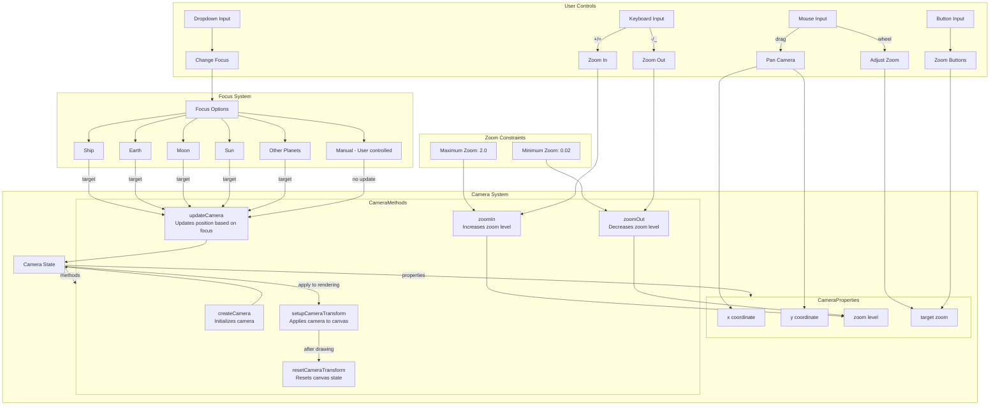

```mermaid
flowchart TD
    subgraph Camera System
        CameraState[Camera State] --> |properties| CameraProperties
        CameraState --> |methods| CameraMethods
        
        subgraph CameraProperties
            X[x coordinate]
            Y[y coordinate]
            Zoom[zoom level]
            TargetZoom[target zoom]
        end
        
        subgraph CameraMethods
            CreateCamera[createCamera\nInitializes camera]
            UpdateCamera[updateCamera\nUpdates position based on focus]
            ZoomIn[zoomIn\nIncreases zoom level]
            ZoomOut[zoomOut\nDecreases zoom level]
            SetupTransform[setupCameraTransform\nApplies camera to canvas]
            ResetTransform[resetCameraTransform\nResets canvas state]
        end
    end
    
    subgraph Focus System
        FocusTypes[Focus Options] --> Ship[Ship]
        FocusTypes --> Earth[Earth]
        FocusTypes --> Moon[Moon]
        FocusTypes --> Sun[Sun]
        FocusTypes --> OtherPlanets[Other Planets]
        FocusTypes --> Manual[Manual - User controlled]
    end
    
    subgraph Zoom Constraints
        MIN_ZOOM[Minimum Zoom: 0.02]
        MAX_ZOOM[Maximum Zoom: 2.0]
    end
    
    subgraph User Controls
        MouseInput[Mouse Input] --> |drag| PanCamera[Pan Camera]
        MouseInput --> |wheel| AdjustZoom[Adjust Zoom]
        KeyInput[Keyboard Input] --> |+/=| ZoomInKey[Zoom In]
        KeyInput --> |-/_| ZoomOutKey[Zoom Out]
        ButtonInput[Button Input] --> ZoomButtons[Zoom Buttons]
        DropdownInput[Dropdown Input] --> ChangeFocus[Change Focus]
    end
    
    CreateCamera --> CameraState
    UpdateCamera --> CameraState
    ZoomIn --> Zoom
    ZoomOut --> Zoom
    
    Ship --> |target| UpdateCamera
    Earth --> |target| UpdateCamera
    Moon --> |target| UpdateCamera
    Sun --> |target| UpdateCamera
    OtherPlanets --> |target| UpdateCamera
    Manual --> |no update| UpdateCamera
    
    MIN_ZOOM --> ZoomOut
    MAX_ZOOM --> ZoomIn
    
    PanCamera --> X
    PanCamera --> Y
    AdjustZoom --> TargetZoom
    ZoomInKey --> ZoomIn
    ZoomOutKey --> ZoomOut
    ZoomButtons --> TargetZoom
    ChangeFocus --> FocusTypes
    
    CameraState --> |apply to rendering| SetupTransform
    SetupTransform --> |after drawing| ResetTransform
```