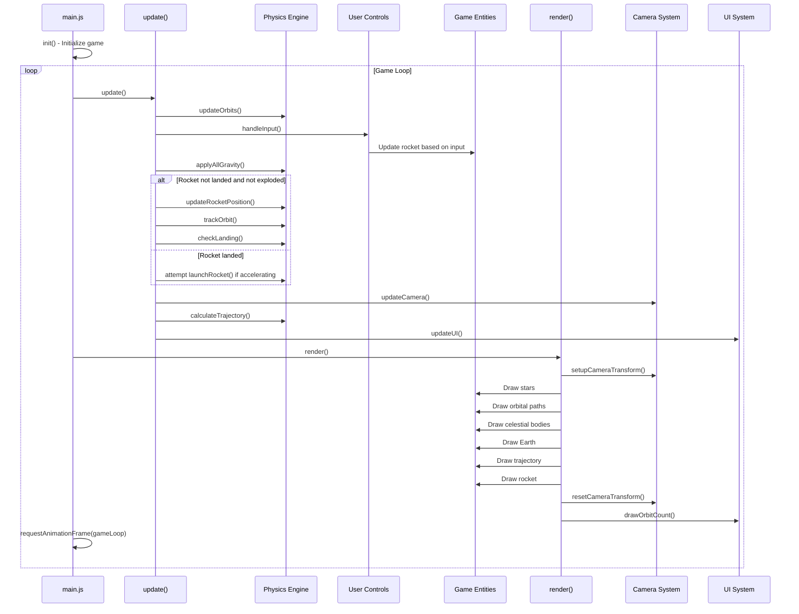

```mermaid
sequenceDiagram
    participant Main as main.js
    participant Update as update()
    participant Physics as Physics Engine
    participant Controls as User Controls
    participant Entities as Game Entities
    participant Render as render()
    participant Camera as Camera System
    participant UI as UI System
    
    Main->>Main: init() - Initialize game
    loop Game Loop
        Main->>Update: update()
        Update->>Physics: updateOrbits()
        Update->>Controls: handleInput()
        Controls->>Entities: Update rocket based on input
        Update->>Physics: applyAllGravity()
        alt Rocket not landed and not exploded
            Update->>Physics: updateRocketPosition()
            Update->>Physics: trackOrbit()
            Update->>Physics: checkLanding()
        else Rocket landed
            Update->>Physics: attempt launchRocket() if accelerating
        end
        Update->>Camera: updateCamera()
        Update->>Physics: calculateTrajectory()
        Update->>UI: updateUI()
        
        Main->>Render: render()
        Render->>Camera: setupCameraTransform()
        Render->>Entities: Draw stars
        Render->>Entities: Draw orbital paths
        Render->>Entities: Draw celestial bodies
        Render->>Entities: Draw Earth
        Render->>Entities: Draw trajectory
        Render->>Entities: Draw rocket
        Render->>Camera: resetCameraTransform()
        Render->>UI: drawOrbitCount()
        
        Main->>Main: requestAnimationFrame(gameLoop)
    end
```