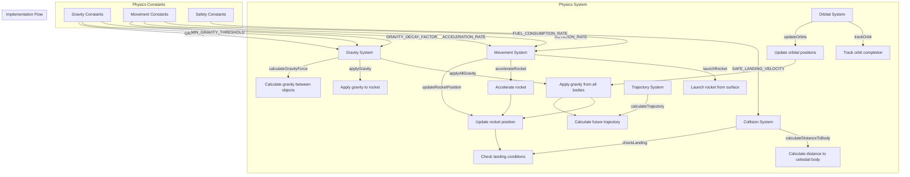

```mermaid
flowchart TD
    subgraph Physics System
        Gravity[Gravity System] --> |calculateGravityForce| GravityCalc[Calculate gravity between objects]
        Gravity --> |applyGravity| GravityApply[Apply gravity to rocket]
        Gravity --> |applyAllGravity| GravityAll[Apply gravity from all bodies]
        
        Movement[Movement System] --> |updateRocketPosition| RocketPos[Update rocket position]
        Movement --> |accelerateRocket| RocketAccel[Accelerate rocket]
        Movement --> |launchRocket| RocketLaunch[Launch rocket from surface]
        
        Collision[Collision System] --> |checkLanding| LandingCheck[Check landing conditions]
        Collision --> |calculateDistanceToBody| DistanceCalc[Calculate distance to celestial body]
        
        Trajectory[Trajectory System] --> |calculateTrajectory| TrajCalc[Calculate future trajectory]
        
        Orbits[Orbital System] --> |updateOrbits| OrbitsUpdate[Update orbital positions]
        Orbits --> |trackOrbit| OrbitsTrack[Track orbit completion]
    end
    
    subgraph Physics Constants
        GravityConst[Gravity Constants]
        MovementConst[Movement Constants]
        SafetyConst[Safety Constants]
    end
    
    GravityConst --> |GRAVITY_FACTOR| Gravity
    GravityConst --> |MIN_GRAVITY_THRESHOLD| Gravity
    GravityConst --> |GRAVITY_DECAY_FACTOR| Gravity
    
    MovementConst --> |ACCELERATION_RATE| Movement
    MovementConst --> |ROTATION_RATE| Movement
    MovementConst --> |FUEL_CONSUMPTION_RATE| Movement
    
    SafetyConst --> |SAFE_LANDING_VELOCITY| Collision
    
    subgraph Implementation Flow
        GravityAll --> TrajCalc
        GravityAll --> RocketPos
        RocketPos --> LandingCheck
        RocketAccel --> RocketPos
        OrbitsUpdate --> GravityAll
    end
```