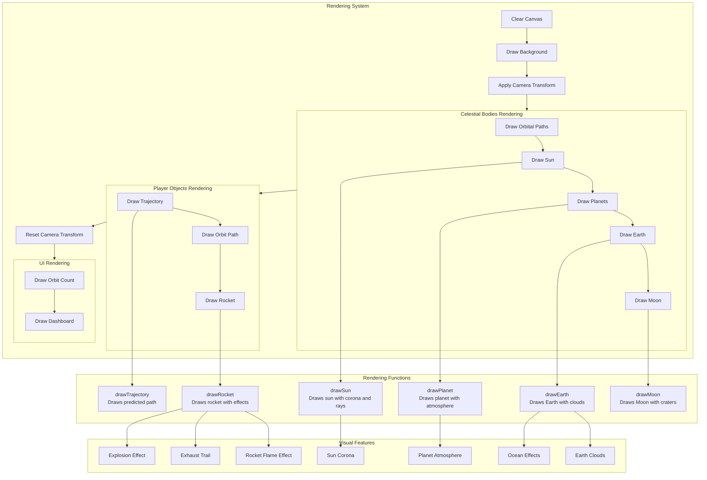

```mermaid
flowchart TD
    subgraph RenderingSystem[Rendering System]
        direction TB
        
        ClearCanvas[Clear Canvas] --> DrawBackground[Draw Background]
        DrawBackground --> ApplyCameraTransform[Apply Camera Transform]
        
        subgraph CelestialBodiesRendering[Celestial Bodies Rendering]
            direction TB
            DrawOrbits[Draw Orbital Paths] --> DrawSun[Draw Sun]
            DrawSun --> DrawPlanets[Draw Planets]
            DrawPlanets --> DrawEarth[Draw Earth]
            DrawEarth --> DrawMoon[Draw Moon]
        end
        
        subgraph PlayerObjectsRendering[Player Objects Rendering]
            direction TB
            DrawTrajectory[Draw Trajectory] --> DrawOrbitPath[Draw Orbit Path]
            DrawOrbitPath --> DrawRocket[Draw Rocket]
        end
        
        ApplyCameraTransform --> CelestialBodiesRendering
        CelestialBodiesRendering --> PlayerObjectsRendering
        PlayerObjectsRendering --> ResetCameraTransform[Reset Camera Transform]
        
        subgraph UIRendering[UI Rendering]
            direction TB
            DrawOrbitCount[Draw Orbit Count] --> DrawDashboard[Draw Dashboard]
        end
        
        ResetCameraTransform --> UIRendering
    end
    
    subgraph RenderingFunctions[Rendering Functions]
        DrawSunFn[drawSun\nDraws sun with corona and rays]
        DrawPlanetFn[drawPlanet\nDraws planet with atmosphere]
        DrawEarthFn[drawEarth\nDraws Earth with clouds]
        DrawMoonFn[drawMoon\nDraws Moon with craters]
        DrawTrajectoryFn[drawTrajectory\nDraws predicted path]
        DrawRocketFn[drawRocket\nDraws rocket with effects]
    end
    
    subgraph VisualFeatures[Visual Features]
        SunCorona[Sun Corona]
        PlanetAtmosphere[Planet Atmosphere]
        Clouds[Earth Clouds]
        Water[Ocean Effects]
        RocketFlame[Rocket Flame Effect]
        ExhaustTrail[Exhaust Trail]
        ExplosionEffect[Explosion Effect]
    end
    
    DrawSun --> DrawSunFn
    DrawPlanets --> DrawPlanetFn
    DrawEarth --> DrawEarthFn
    DrawMoon --> DrawMoonFn
    DrawTrajectory --> DrawTrajectoryFn
    DrawRocket --> DrawRocketFn
    
    DrawSunFn --> SunCorona
    DrawPlanetFn --> PlanetAtmosphere
    DrawEarthFn --> Clouds
    DrawEarthFn --> Water
    DrawRocketFn --> RocketFlame
    DrawRocketFn --> ExhaustTrail
    DrawRocketFn --> ExplosionEffect
```