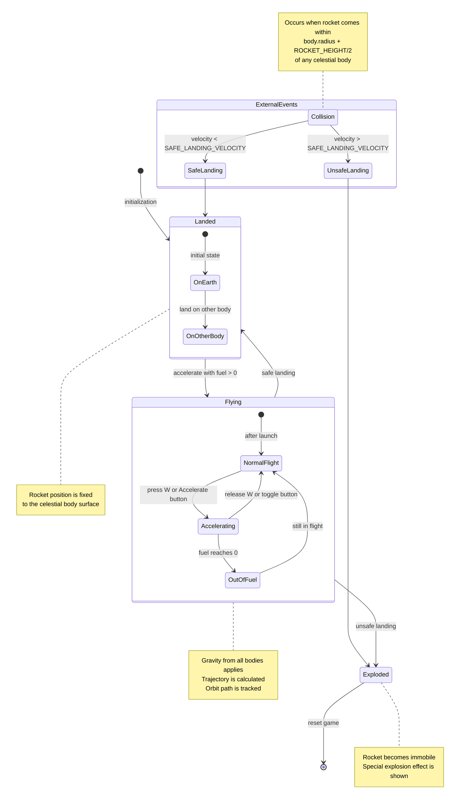

```mermaid
stateDiagram-v2
    [*] --> Landed: initialization
    
    state Landed {
        [*] --> OnEarth: initial state
        OnEarth --> OnOtherBody: land on other body
    }
    
    state Flying {
        [*] --> NormalFlight: after launch
        NormalFlight --> Accelerating: press W or Accelerate button
        Accelerating --> NormalFlight: release W or toggle button
        Accelerating --> OutOfFuel: fuel reaches 0
        OutOfFuel --> NormalFlight: still in flight
    }
    
    state ExternalEvents {
        Collision
        SafeLanding
        UnsafeLanding
    }
    
    Landed --> Flying: accelerate with fuel > 0
    Flying --> Landed: safe landing
    Flying --> Exploded: unsafe landing
    
    Exploded --> [*]: reset game
    
    Collision --> SafeLanding: velocity < SAFE_LANDING_VELOCITY
    Collision --> UnsafeLanding: velocity > SAFE_LANDING_VELOCITY
    
    SafeLanding --> Landed
    UnsafeLanding --> Exploded
    
    note right of Landed
        Rocket position is fixed 
        to the celestial body surface
    end note
    
    note right of Flying
        Gravity from all bodies applies
        Trajectory is calculated
        Orbit path is tracked
    end note
    
    note right of Exploded
        Rocket becomes immobile
        Special explosion effect is shown
    end note
    
    note left of Collision
        Occurs when rocket comes within
        body.radius + ROCKET_HEIGHT/2
        of any celestial body
    end note
```