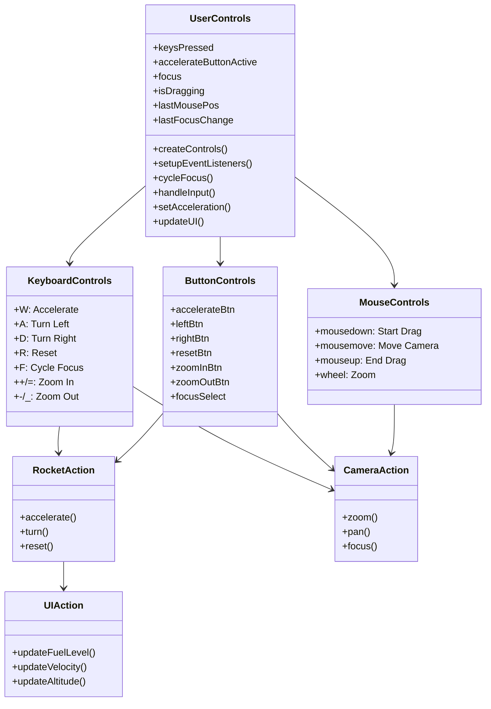

```mermaid
classDiagram
    class UserControls {
        +keysPressed
        +accelerateButtonActive
        +focus
        +isDragging
        +lastMousePos
        +lastFocusChange
        +createControls()
        +setupEventListeners()
        +cycleFocus()
        +handleInput()
        +setAcceleration()
        +updateUI()
    }
    
    class KeyboardControls {
        +W: Accelerate
        +A: Turn Left
        +D: Turn Right
        +R: Reset
        +F: Cycle Focus
        ++/=: Zoom In
        +-/_: Zoom Out
    }
    
    class ButtonControls {
        +accelerateBtn
        +leftBtn
        +rightBtn
        +resetBtn
        +zoomInBtn
        +zoomOutBtn
        +focusSelect
    }
    
    class MouseControls {
        +mousedown: Start Drag
        +mousemove: Move Camera
        +mouseup: End Drag
        +wheel: Zoom
    }
    
    class RocketAction {
        +accelerate()
        +turn()
        +reset()
    }
    
    class CameraAction {
        +zoom()
        +pan()
        +focus()
    }
    
    class UIAction {
        +updateFuelLevel()
        +updateVelocity()
        +updateAltitude()
    }
    
    UserControls --> KeyboardControls
    UserControls --> ButtonControls
    UserControls --> MouseControls
    
    KeyboardControls --> RocketAction
    KeyboardControls --> CameraAction
    
    ButtonControls --> RocketAction
    ButtonControls --> CameraAction
    
    MouseControls --> CameraAction
    
    RocketAction --> UIAction
```